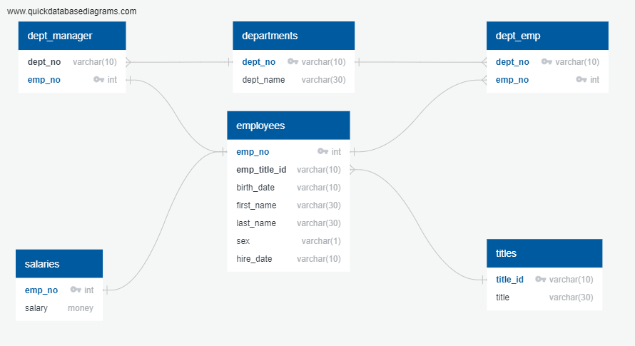

# SQL-Employee_Database_Queries 
This project looks at a large fictitious tech company that is wanting to run some queries on their past employees. 

There are six CSV files:  **departments, dept_emp, dept_manager, employees, salaries** and **titles**.  I constructed an entity-relationship diagram or ERD to show the relationship between each table.

As such, this project has two main focuses: Data Engineering & Data Analysis with SQL.
#### Data Engineering
An [ERD](Data_Engineering/ERD.png) was created showing the relationship between the six CSV files. This ERD was then used to construct a [table schema](Data_Engineering/ERD-Documentation.pdf) for each of the CSV files to assist with importing the CSV files into SQL. 

[ERD-Documentation](Data_Engineering/ERD-Documentation.pdf) 
#### Data Analysis
After creating the ERD, the CSV files were imported into SQL using **pgAdmin 4**. I produced the following lists:
1. The employee number, last name, first name, sex, and salary pf each employee.
2. First name, last name, and hire date for employees who were hired in 1986.
3. The manager of each department with the following information: department number, department name, the manager's employee number, last name, first name.
4. The department of each employee with the following information: employee number, last name, first name, and department name.
5. The first name, last name, and sex for employees whose first name is "Hercules" and last names begin with "B."
6. All employees in the Sales department, including their employee number, last name, first name, and department name.
7. All employees in the Sales and Development departments, including their employee number, last name, first name, and department name.
8. In descending order, the frequency count of employee last names, i.e., how many employees share each last name.
---
### Tech Stack
* SQL (pgAdmin 4)
* Python
* Jupter Notebook

### User Instructions
* Clone the repository: git clone https://github.com/DarrylB32/SQL-Employee_Database_Queries.git  
* Establish SQL database to query from
* Import the tables into your database
* Open the [Data Analysis](Data_Analysis/data_analysis.sql) schema in your SQL database and execute each statement.
 
### Additional Notes
In the near future I plan to create a histogram to visualize the most common salary ranges for employees and a bar chart of average salary by title using Python.